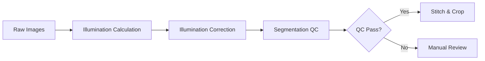
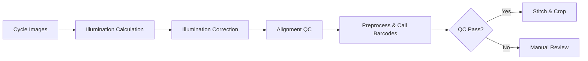

# Overview

## What is nf-pooled-cellpainting?

nf-pooled-cellpainting is a Nextflow pipeline designed for **optical pooled screening (OPS)**, a high-throughput technique that combines:

1. **Cell Painting**: Multi-channel fluorescence microscopy for phenotypic profiling
2. **Barcoding**: Sequencing-by-synthesis (SBS) for genetic identification

This approach enables screening of thousands of genetic perturbations while maintaining single-cell resolution.

## Pipeline Workflow

The pipeline consists of two parallel processing arms that converge for combined analysis:

### Cell Painting Arm

### Barcoding Arm

### Combined Analysis

When both arms pass QC, the pipeline merges the data for:

- Cell segmentation using painting channels
- Barcode assignment to segmented cells
- Feature extraction and measurements
- Comprehensive CSV outputs

## Key Concepts

### Quality Control Gates

The pipeline includes **QC gates** controlled by parameters:

- `qc_painting_passed`: Enables progression past painting QC
- `qc_barcoding_passed`: Enables progression past barcoding QC

These gates allow manual review before committing to expensive downstream processing.

### Parallelization Strategy

Processing is parallelized at optimal granularity:

- **Illumination calculation**: Per plate (or plate+cycle for barcoding)
- **Illumination correction**: Per site for both arms
- **Stitching**: Per well
- **Combined analysis**: Per site

### Data Organization

Input data follows a structured samplesheet format with metadata for:

- `batch`, `plate`, `well`, `site`: Spatial organization
- `cycle`: Sequencing round (barcoding only)
- `channels`: Fluorescence channels
- `n_frames`: Number of tiles per site

## Technology Stack

- **Nextflow**: Workflow orchestration and parallelization
- **CellProfiler**: Image analysis and feature extraction
- **Fiji**: Image stitching and montage generation
- **Python**: CSV generation and QC analysis
- **Docker/Singularity**: Containerized execution

## Next Steps

- [Installation Guide](installation.md) - Set up the pipeline
- [Quick Start](quickstart.md) - Run your first analysis
- [Parameters Reference](../usage/parameters.md) - Configure the pipeline
