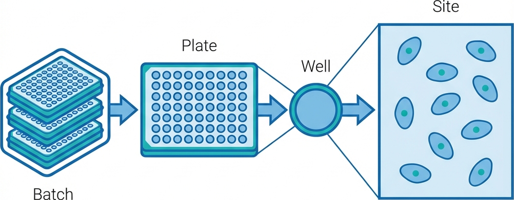

# Overview

## What is Optical Pooled Screening?

Imagine you want to understand how thousands of different genes affect cell behavior. Traditionally, you would need to test each gene one at a time - an incredibly slow process. Optical Pooled Screening (OPS) changes this by letting you test many genes simultaneously in the same dish of cells, then use imaging to figure out which gene is in which cell and what it's doing.

This pipeline combines two powerful technologies:

1. **Cell Painting** captures what cells *look like*. By staining different parts of the cell (nucleus, mitochondria, etc.) with fluorescent dyes, we can measure hundreds of features describing each cell's shape, size, and internal organization. These features tell us how cells respond to genetic perturbations.

2. **In-situ Sequencing (ISS)** tells us what gene is *in* each cell. Each genetic perturbation (like a CRISPR guide) carries a unique DNA barcode. By reading this barcode directly in the microscope image, we can link every cell to its genetic modification.

The magic happens when we combine both: for each cell, we know both its genetic identity (from barcoding) and its phenotype (from Cell Painting). This lets us screen thousands of genes in a single experiment and see how each one changes cell appearance.

## Pipeline Architecture

The pipeline is designed with two parallel processing "arms" that operate independently before converging for the final analysis.

### 1. Cell Painting Arm (Phenotype)

This arm processes the morphological images.

- **Illumination Correction**: Corrects for uneven lighting across the field of view, which is critical for accurate intensity measurements.
- **Segmentation**: Identifies individual cells and nuclei. This is the foundation of the analysis—if segmentation fails, downstream data is invalid.
- **QC Check**: Generates visual montages to verify that segmentation is performing correctly before proceeding.

### 2. Barcoding Arm (Genotype)

This arm processes the sequencing-by-synthesis (SBS) images.

- **Alignment**: Registers images from multiple sequencing cycles (rounds) to the first cycle to ensure perfect overlap.
- **Base Calling**: Reads the sequence of fluorescent bases (A, C, G, T) at each pixel to decode the barcode.
- **QC Check**: Verifies that barcodes are being called with high confidence and aligning to the known library.

### 3. Convergence (Single-Cell Mapping)

Once both arms pass quality control, they are stitched and merged. The pipeline maps the decoded barcodes from the Barcoding Arm to the segmented cells from the Cell Painting Arm, creating a unified dataset where every cell has both a phenotype and an assigned genetic perturbation.

## Data Hierarchy

Understanding how the pipeline organizes data is key to preparing your inputs correctly.

- **Batch**: A collection of plates processed together.
- **Plate**: A physical multi-well plate (e.g., 96 or 384 wells).
- **Well**: A single experimental unit within a plate.
- **Site**: A specific field of view within a well.
- **Cycle** (Barcoding only): Represents a round of sequencing. Cycle 1 is usually the reference for alignment.

## The "Stop-and-Check" Philosophy

Processing terabytes of high-content imaging data is computationally expensive. To avoid wasting resources on poor-quality data, the pipeline implements a **"Stop-and-Check"** workflow. This stop and check behaviour is controlled by two pipeline parameters (`--qc_painting_passed` and `--qc_barcoding_passed`), which are both false by default, causing the pipeline to stop before stitch and cropping via Fiji.

1.  **Phase 1: Raw data processing:**
    The pipeline runs illumination correction, segmentation (for painting arm) and image alignment across cycles (for barcoding arm) and generates QC images and metrics. It then **stops** processing for the user to manually verify

2.  **Phase 2: Manual Review:**
    You review the QC outputs in the `results/qc` folder (or in the Reports tab if running via Seqera Platform).

3.  **Phase 3: Production Run:**
    If the data looks good, you "open the gates" by setting the parameters `--qc_painting_passed` and `--qc_barcoding_passed` to `true` and resuming the pipeline. It will pick up exactly where it left off and proceed to the heavy lifting: stitching, feature extraction, and CSV generation. If you only turn one of the parameters to true, that arm (painting or barcoding) will continue with stitching and cropping but then stop because the final combined analysis step needs the outputs from both painting and barcoding.
