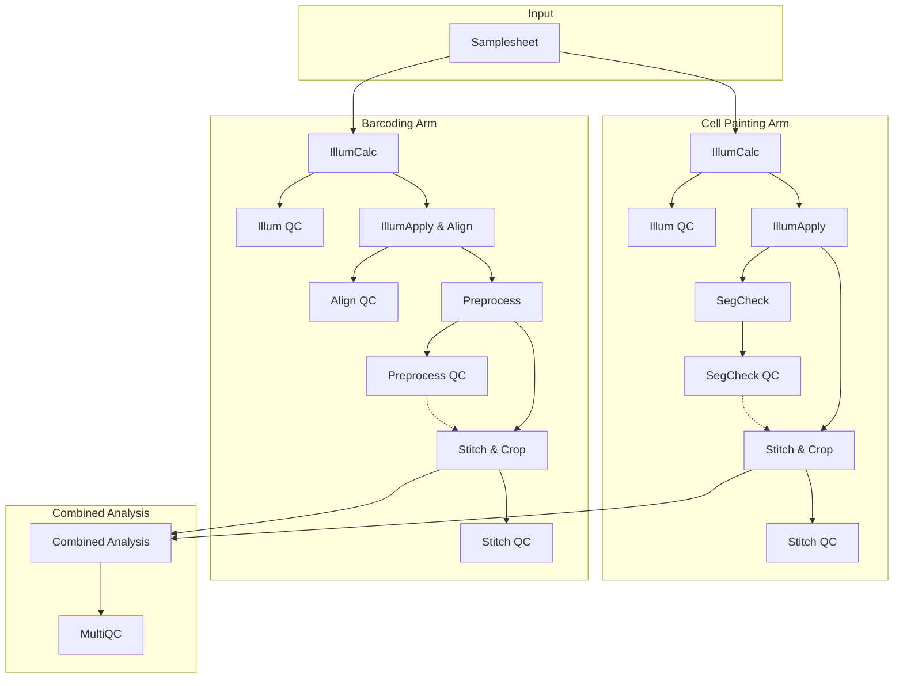

# User Guide

This comprehensive guide covers everything you need to run the nf-pooled-cellpainting pipeline, from installation through production deployment on AWS.

## Overview

### What is Optical Pooled Screening?

Optical Pooled Screening (OPS) enables high-throughput functional genomics by combining genetic perturbations with image-based phenotyping at single-cell resolution. Unlike traditional arrayed screening approaches that test perturbations individually, OPS allows thousands of genetic variants to be assayed simultaneously within a single pooled population, with cellular identity decoded through in situ sequencing.

This pipeline integrates two complementary methodologies:

1. **Cell Painting** is a morphological profiling assay that produces single-cell, quantitative phenotypic measurements. Through multiplexed fluorescent labeling of cellular compartments (DNA, endoplasmic reticulum, mitochondria, actin, Golgi apparatus, nucleoli, plasma membrane, and cytoplasmic RNA), this approach generates high-dimensional feature vectors describing cellular morphology, organization, and intensity distributions.

2. **In-situ Sequencing**, also known as sequencing-by-synthesis (SBS) enables spatial genotyping through cyclical imaging of fluorescently labeled nucleotides. Each genetic perturbation is tagged with a unique DNA barcode sequence. Sequential rounds of hybridization, imaging, and base calling reconstruct these barcodes directly within the microscopy field of view.

The integration of these modalities yields matched genotype-phenotype data at single-cell resolution.

### Pipeline Architecture

The pipeline processes data through two parallel arms that operate independently before converging for final analysis:



#### Cell Painting Arm (Phenotype)

- **Illumination Correction & Application**: Calculates and applies flat-field illumination correction
- **Segmentation Check**: Verifies cell/nuclei segmentation quality on a subset of images
- **Stitch & Crop**: Stitches fields of view into whole-well images and crops into tiles

#### Barcoding Arm (Genotype)

- **Illumination Correction & Alignment**: Calculates and applies flat-field illumination correction, then aligns all cycles to cycle 1
- **Preprocessing**: Compensates for spectral bleed-through, identifies barcode foci, and generates QC metrics
- **Stitch & Crop**: Stitches and crops to match Cell Painting tiles

#### Combined Analysis

Once both arms pass quality control, the final **Analysis** pipeline aligns Cell Painting and barcoding images, segments cells from the phenotypic stains, measures morphological features, reads an SBS barcodes for each SBS focus and selects a best match from the barcode library, and assigns barcode foci to cells — linking each cell's genotype to its phenotype.

### The "Stop-and-Check" Workflow

Making morphological measurements in high-content imaging data is computationally expensive. To avoid wasting resources on poor-quality data, the pipeline implements a **"Stop-and-Check"** workflow controlled by two parameters:

- `--qc_painting_passed` (default: `false`)
- `--qc_barcoding_passed` (default: `false`)

**Phase 1 - Initial Processing**: The pipeline runs through the QC checkpoints for both arms (SegCheck QC for painting, Preprocess QC for barcoding), generates QC montages, and **stops before Stitch & Crop**.

**Phase 2 - Manual Review**: You review QC outputs in `results/workspace/qc_reports/`.

**Phase 3 - Production Run**: If data looks good, set `--qc_painting_passed true` and `--qc_barcoding_passed true`, then resume with `-resume`. The pipeline continues from cached results.

### Data Hierarchy

Understanding how the pipeline organizes data:

| Level | Description | Example |
|-------|-------------|---------|
| **Batch** | Collection of plates processed together | `Batch1` |
| **Plate** | Physical multi-well plate | `Plate1` |
| **Well** | Single experimental unit | `A01` |
| **Site** | Field of view within a well | `1`, `2`, `3`... |
| **Cycle** | Sequencing round for barcoding. Also supports multi-round phenotype acquisition | `1`, `2`, `3`... |

---

## Installation

### Option 1: Local Execution with Nextflow CLI

Best for development, testing, or running on a single server.

#### Local Prerequisites

1. **Java**: Version 11 or later
2. **Nextflow**: Version 25.04.0 or later
3. **Docker**: Engine must be installed and running

#### Local Setup

1. Install Nextflow:

    ```bash
    curl -s https://get.nextflow.io | bash
    mv nextflow /usr/local/bin/
    ```

2. Verify installation:

    ```bash
    nextflow run broadinstitute/nf-pooled-cellpainting -profile docker --help -r dev
    ```

### Option 2: Cloud Execution with Seqera Platform

Recommended for production runs at scale. See [Running on AWS with Seqera Platform](#running-on-aws-with-seqera-platform) for detailed setup instructions.

---

## Quick Start

This walkthrough uses the built-in test profile to demonstrate the complete two-phase workflow.

### Step 1: Run the Test Profile (Phase 1)

The test profile automatically downloads a small dummy dataset containing:

- A subset of images from one well (both Cell Painting and Barcoding arms)
- Pre-configured CellProfiler pipelines
- A sample Barcodes.csv file

```bash
nextflow run broadinstitute/nf-pooled-cellpainting \
    -profile test,docker \
    --outdir results
```

The pipeline will:

1. Download the test dataset
2. Run illumination calculation and application
3. Run segmentation (Cell Painting) and barcode calling (Barcoding)
4. Generate QC montages
5. **Stop** before stitching (this is expected behavior)

Expected runtime: 15-20 minutes locally, 5-10 minutes on AWS Batch.

### Step 2: Inspect QC Outputs

Navigate to `results/workspace/qc_reports/`:

```text
results/workspace/qc_reports/
├── 1_illumination_painting/
├── 3_segmentation/
├── 5_illumination_barcoding/
├── 6_alignment/
└── 7_preprocessing/
```

On real data, check for the following. Note that the test data is too small to produce meaningful QC:

- **Illumination montages**: Smooth, gradual intensity variations (not patchy)
- **Segmentation previews**: Cell/nucleus outlines accurately trace boundaries
- **Alignment reports**: Small, consistent pixel shifts across the field

### Step 3: Complete the Run (Phase 2)

Resume with QC flags set to `true`:

```bash
nextflow run broadinstitute/nf-pooled-cellpainting \
    -profile test,docker \
    --outdir results \
    --qc_painting_passed true \
    --qc_barcoding_passed true \
    -resume
```

!!! important "The `-resume` flag is critical"
    It tells Nextflow to use cached results and only execute new steps. Without it, the pipeline restarts from scratch.

### Step 4: Explore Final Outputs

After completion, your `results/` directory contains:

```text
results/
├── images/                    # All processed images by batch/stage
│   └── Batch1/
│       ├── illum/
│       ├── images_corrected/
│       ├── images_corrected_cropped/
│       └── images_corrected_stitched/
├── workspace/
│   ├── analysis/              # Final CSV results (most important!)
│   ├── load_data_csv/         # CellProfiler input files
│   └── qc_reports/            # QC visualizations
├── multiqc/                   # Summary report
└── pipeline_info/             # Execution logs and metrics
```

The most important outputs are in `results/workspace/analysis/`—CSV files containing linked phenotype and genotype data for every cell.

---

## Using Your Own Data

### Required Input Files

#### 1. Samplesheet (CSV)

Maps image files to experimental metadata.

| Column | Description | Format |
|--------|-------------|--------|
| `path` | Path to image file | Absolute path or S3 URI |
| `arm` | Experimental arm | `painting` or `barcoding` |
| `batch` | Batch identifier | String |
| `plate` | Plate identifier | String |
| `well` | Well identifier | String (e.g., `A01`) |
| `channels` | Channel names | Comma-separated string |
| `site` | Site number | Integer |
| `cycle` | Cycle number (required for barcoding. Supported for phenotyping) | Integer |
| `n_frames` | Number of frames | Integer |

**Example:**

```csv
path,arm,batch,plate,well,channels,site,cycle,n_frames
"/data/painting/WellA1_ChannelDNA,GFP_Seq0000.ome.tiff",painting,Batch1,Plate1,A1,"DNA,GFP",1,1,2
"/data/barcoding/WellA1_ChannelC,A,T,G,DNA_Seq0000.ome.tiff",barcoding,Batch1,Plate1,A1,"C,A,T,G,DNA",1,1,5
"/data/barcoding/WellA1_ChannelC,A,T,G,DNA_Seq0001.ome.tiff",barcoding,Batch1,Plate1,A1,"C,A,T,G,DNA",1,2,5
```

!!! warning "Channel Names Must Match"
    Channel names in the `channels` column must match the names used in your CellProfiler pipelines and parsed from filenames.

#### 2. Barcodes File (CSV)

Defines known barcodes in your library.

```csv
barcode_id,sequence
id1,TAAATAGTAGGATTTACACG
id2,TAGGTGATATCAATCGATAC
id3,ATAGCTGATTCCATTCGCTA
```

#### 3. CellProfiler Pipelines (.cppipe)

You must provide pipeline files for each processing stage:

**Cell Painting Arm:**

- `--painting_illumcalc_cppipe`: Illumination calculation
- `--painting_illumapply_cppipe`: Illumination correction
- `--painting_segcheck_cppipe`: Segmentation QC

**Barcoding Arm:**

- `--barcoding_illumcalc_cppipe`: Illumination calculation
- `--barcoding_illumapply_cppipe`: Illumination correction
- `--barcoding_preprocess_cppipe`: Base calling

**Combined:**

- `--combinedanalysis_cppipe`: Final segmentation and feature extraction

!!! tip "Example Pipelines"
    The test profiles include working example pipelines in `assets/cellprofiler/` and `assets/cpg0032_test_cppipes/`.

### Channel Naming Constraints

The pipeline uses regex patterns to parse filenames. Follow these rules:

**Cell Painting:**

- Raw images must contain channel names from your samplesheet
- Corrected images follow pattern: `Plate_{plate}_Well_{well}_Site_{site}_Corr{channel}.tiff`

**Barcoding:**

- Use standard base names: `A`, `C`, `G`, `T`, `DNA`, or `DAPI`
- Cycle images follow pattern: `Plate_{plate}_Well_{well}_Site_{site}_Cycle{cycle}_{channel}.tiff`

!!! danger "Avoid These Keywords"
    Do not use `Cycle` or `Corr` in your raw channel names—this confuses the regex parser.

### Running the Pipeline

```bash
nextflow run broadinstitute/nf-pooled-cellpainting \
    -profile docker \
    --input samplesheet.csv \
    --barcodes barcodes.csv \
    --outdir results \
    --painting_illumcalc_cppipe painting_illumcalc.cppipe \
    --painting_illumapply_cppipe painting_illumapply.cppipe \
    --painting_segcheck_cppipe painting_segcheck.cppipe \
    --barcoding_illumcalc_cppipe barcoding_illumcalc.cppipe \
    --barcoding_illumapply_cppipe barcoding_illumapply.cppipe \
    --barcoding_preprocess_cppipe barcoding_preprocess.cppipe \
    --combinedanalysis_cppipe combinedanalysis.cppipe
```

---

## Running on AWS with Seqera Platform

Seqera Platform (formerly Nextflow Tower) provides a web interface for launching, monitoring, and managing Nextflow pipelines on cloud infrastructure. This section covers setting up AWS Batch compute environments and configuring the pipeline for production runs.

### AWS Prerequisites

1. **Seqera Platform Account**: Access to a workspace at [cloud.seqera.io](https://cloud.seqera.io)
2. **AWS Account**: With permissions to create Batch resources
3. **AWS Credentials**: Configured in Seqera Platform
4. **S3 Bucket**: For work directory and data storage

### Setting Up an AWS Batch Compute Environment

From your Seqera Platform workspace, navigate to **Compute Environments** → **Add Compute Environment**.

#### Basic Configuration

| Setting | Recommended Value | Notes |
|---------|-------------------|-------|
| **Name** | `AWSBatch_pooled_cellpainting` | Descriptive name |
| **Platform** | AWS Batch | |
| **Credentials** | Your AWS credentials | Must have AWS Batch permissions |
| **Region** | `us-east-1` (or your preferred region) | Should match your S3 bucket |
| **Work directory** | `s3://your-bucket/work` | Pipeline scratch data |

#### Seqera Features (Optional but Recommended)

| Feature | Description | Recommendation |
|---------|-------------|----------------|
| **Wave containers** | Container provisioning service | Enable for easier container management |
| **Fusion v2** | Virtual distributed file system for S3 | Enable for faster S3 access |
| **Fast instance storage** | NVMe for faster I/O | Enable if using Fusion v2 |
| **Fusion Snapshots** | Auto-restore on spot interruption | Enable for spot instance resilience |

#### Config Mode: Batch Forge

Select **Batch Forge** for automated queue creation. Seqera will create:

- A head queue (for the Nextflow process)
- A compute queue (for pipeline tasks)

#### Forge Configuration

| Setting | Recommended Value | Notes |
|---------|-------------------|-------|
| **Provisioning model** | Spot | Cost-effective; use On-demand for critical runs |
| **Max CPUs** | 2000 | Total CPU pool; adjust based on workload |
| **Allowed S3 buckets** | Your data bucket(s) | Grant read-write access |
| **EFS/FSx** | None | Not required for most use cases |

#### Advanced Options: Instance Types

For image processing workloads, select instance families with:

- Good compute-to-memory ratio
- NVMe storage (if using Fusion)

**Recommended instance types:**

- `c6id` - Compute-optimized with NVMe
- `m6id` - General-purpose with NVMe
- `r6id` - Memory-optimized with NVMe

!!! warning "Fusion Snapshots: Pin Specific Instance Sizes"
    When using Fusion Snapshots, **pin specific instance sizes** (not just families) to ensure successful snapshot creation. Snapshots require sufficient memory-to-NVMe-bandwidth ratio to complete within the 2-minute spot reclamation window.

    **Recommended for Fusion Snapshots** (pin all of these in your compute environment):

    - `c6id.large`, `c6id.xlarge`, `c6id.2xlarge`, `c6id.4xlarge`, `c6id.8xlarge`, `c6id.12xlarge`

    Avoid letting AWS auto-select very large instances (e.g., `32xlarge`) which may sit idle after tasks complete, costing ~$6/hour for minimal utilization. The `12xlarge` ceiling provides sufficient memory for most Combined Analysis tasks while limiting cost exposure.

### Configuring the Pipeline in Seqera Platform

Navigate to **Launchpad** → **Add Pipeline**.

#### Pipeline Settings

| Setting | Value |
|---------|-------|
| **Name** | `nf-pooled-cellpainting` |
| **Pipeline to launch** | `https://github.com/broadinstitute/nf-pooled-cellpainting` |
| **Revision** | `dev` (or a specific tag) |
| **Compute environment** | Your AWS Batch environment |
| **Work directory** | `s3://your-bucket/work` |
| **Config profiles** | `test` (for testing) or leave empty |

#### Pipeline Parameters

For test runs, the `test` profile provides all necessary parameters. For custom data, provide parameters as JSON or YAML:

```yaml
input: "s3://your-bucket/samplesheet.csv"
barcodes: "s3://your-bucket/barcodes.csv"
outdir: "s3://your-bucket/results"
painting_illumcalc_cppipe: "s3://your-bucket/pipelines/painting_illumcalc.cppipe"
# ... other cppipe parameters
```

### Launching and Monitoring Runs

1. **Launch**: Click **Launch** from the pipeline page
2. **Monitor**: View real-time task execution in the **Runs** tab
3. **QC Review**: Check outputs in the S3 bucket or via the **Reports** tab
4. **Resume**: After QC review, click **Resume** (not Relaunch!) with updated parameters:

```yaml
qc_painting_passed: true
qc_barcoding_passed: true
```

!!! important "Resume vs Relaunch"
    **Resume** uses cached results; **Relaunch** starts from scratch. Always use Resume after QC review.

### Cost Optimization Tips

1. **Use Spot Instances**: 60-90% cost savings for fault-tolerant workloads
2. **Enable Fusion Snapshots**: Automatically recover from spot interruptions
3. **Right-size Max CPUs**: Start with 500-1000, increase based on queue times
4. **Use Appropriate Instance Types**: Memory-optimized (`r6id`) for Combined Analysis; compute-optimized (`c6id`) for illumination steps
5. **Clean Up Work Directory**: Periodically delete old work directories from S3
6. **Route Long Tasks to On-Demand**: See below for avoiding spot reclaim losses on multi-hour tasks

### Routing Long-Running Tasks to On-Demand Instances

Long-running tasks like `FIJI_STITCHCROP` (up to 4-6 hours) and `CELLPROFILER_COMBINEDANALYSIS` risk losing hours of work if spot instances are reclaimed. To avoid this:

1. **Create an on-demand compute environment** in Seqera Platform (duplicate your spot environment, disable Fusion Snapshots since they're unnecessary for on-demand)

2. **Route specific processes** to the on-demand queue by adding to your Nextflow config:

```groovy
process {
    withName: 'FIJI_STITCHCROP' {
        queue = '<on-demand-queue-name>'
    }
    withName: 'CELLPROFILER_COMBINEDANALYSIS' {
        queue = '<on-demand-queue-name>'
    }
}
```

The queue name is visible in your Seqera Platform compute environment under "Manual config attributes".

!!! tip "When to use on-demand"
    Use on-demand for tasks that: (1) run longer than 1-2 hours, (2) have experienced repeated spot reclamations, or (3) are in the final stages of a critical run

### Resource Requirements by Process

| Process | CPU | Memory | Notes |
|---------|-----|--------|-------|
| CELLPROFILER_ILLUMCALC | 1 | 2 GB | Per plate |
| CELLPROFILER_ILLUMAPPLY | 1-2 | 6 GB | Per well/site |
| CELLPROFILER_PREPROCESS | 4 | 8 GB | Per site |
| FIJI_STITCHCROP | 6 | 36 GB | Memory-intensive |
| CELLPROFILER_COMBINEDANALYSIS | 4 | 12-32 GB | Most demanding |

To override defaults, add to your Nextflow config:

```groovy
process {
    withName: 'CELLPROFILER_COMBINEDANALYSIS' {
        memory = '64.GB'
    }
}
```

---

## Frequently Asked Questions

### General Pipeline Questions

**How do I resume a failed run?**

Add `-resume` to your command. Nextflow checks the cache and only runs incomplete or changed steps:

```bash
nextflow run broadinstitute/nf-pooled-cellpainting ... -resume
```

**The pipeline stops after QC. Is it broken?**

No, this is intentional. The pipeline pauses for manual QC review. To continue:

```bash
--qc_painting_passed true --qc_barcoding_passed true
```

**Can I run with only Cell Painting data (no barcoding)?**

Yes. Include only painting entries in your samplesheet. The barcoding arm won't run, but Combined Analysis (which requires both arms) will be skipped.

### Resource Requirements

**How much memory and CPU do I need?**

Most processes need 1 CPU and 2-6 GB memory. Memory-intensive tasks:

| Process | Memory Needed |
|---------|---------------|
| FIJI_STITCHCROP | 36+ GB |
| CELLPROFILER_COMBINEDANALYSIS | 32+ GB |
| CELLPROFILER_PREPROCESS | 8 GB |

**How long does a typical run take?**

| Profile | Description | Runtime |
|---------|-------------|---------|
| `test` | Minimal dataset | 5-10 minutes |
| `test_full` | 1 well, multiple sites | Several hours |
| `test_cpg0032` | 2 wells, 12 cycles | 9-10 hours |

### Troubleshooting

**My images are not being found. Why?**

Check your samplesheet `path` column. Paths must be:

- Absolute paths (not relative)
- Valid S3 URIs for cloud execution
- Accessible from the execution environment

**I see "command not found" errors.**

Ensure you're using the Docker profile:

```bash
-profile docker
```

**I get "Missing output file(s) expected by process"**

The process ran successfully (exit code 0) but didn't produce expected files. Common causes:

- CellProfiler flagged all images
- Empty input directory
- Silent tool failure

Debug by checking the work directory:

```bash
# In the failed task's work directory:
cat .command.log    # stdout/stderr
cat .command.sh     # exact command
cat .command.err    # error output
```

**How do I know if QC passed?**

Review outputs in `results/workspace/qc_reports/`:

- **Illumination**: Smooth gradients, no patches
- **Segmentation**: Accurate cell boundaries
- **Alignment**: Small, consistent pixel shifts

### CellProfiler Pipelines

**Where can I find example pipelines?**

- `assets/cellprofiler/` - Test profile pipelines
- `assets/cpg0032_test_cppipes/` - Production-quality examples from cpg0032 dataset

**My CellProfiler pipeline fails with "Plugin not found"**

Ensure the pipeline has internet access to download plugins, or provide local plugin paths:

```bash
--callbarcodes_plugin /path/to/callbarcodes.py
--compensatecolors_plugin /path/to/compensatecolors.py
```

---

## Next Steps

- **[Parameters Reference](parameters.md)**: Complete list of all pipeline parameters
- **[Technical Reference](reference.md)**: Architecture details, CellProfiler integration, output formats

---

!!! info "For Document Contributors"
    This section contains editorial guidelines for maintaining this document. These guidelines are intended for contributors and maintainers, not end users.

    **Purpose and Audience**

    This document is the primary user-facing guide for the nf-pooled-cellpainting pipeline. It targets users who:

    - Are new to the pipeline and need installation guidance
    - Want to run the test profile to verify their setup
    - Need to adapt the pipeline for their own datasets
    - Plan to deploy the pipeline at scale on AWS

    **Guiding Structure Principles**

    1. **Single comprehensive document** - Consolidate all user-facing content here rather than fragmenting across multiple files
    2. **Progressive disclosure** - Start with overview, then installation, quickstart, custom data, cloud deployment, FAQ
    3. **Copy-pastable commands** - All bash commands should work as written without modification
    4. **QC workflow emphasis** - The "Stop-and-Check" workflow is central; ensure it's explained clearly with the `-resume` flag

    **Content Style Principles**

    5. **Concrete examples** - Use real file paths from the test profile and screenshots from Seqera Platform
    6. **Tables for reference data** - Use tables for parameters, file formats, and resource requirements
    7. **Admonitions for warnings** - Use `!!! warning`, `!!! important`, `!!! tip` for callouts
    8. **Mermaid for architecture** - Keep diagrams simple and focused on data flow

    **Terminology Consistency**

    - **Cell Painting** - The phenotypic imaging arm (use full term, not "CP")
    - **Barcoding** - The genotype arm using Sequencing by Synthesis (SBS)
    - **Seqera Platform** - Current name (not "Nextflow Tower")
    - **QC gates** - The `qc_painting_passed` and `qc_barcoding_passed` parameters
    - **Resume** - Always emphasize `-resume` flag when continuing after QC review

    **Document Relationships**

    - **index.md** - Landing page that links here; keep navigation links in sync
    - **reference.md** - Technical details; link there for architecture deep-dives
    - **parameters.md** - Auto-generated; don't duplicate parameter descriptions here

    **Future Enhancements**

    Consider expanding with:

    - Troubleshooting section with common error messages and solutions
    - Screenshots of QC outputs showing pass/fail examples
    - Cost estimation guidance for AWS runs
    - Integration with Cell Painting Gallery datasets
