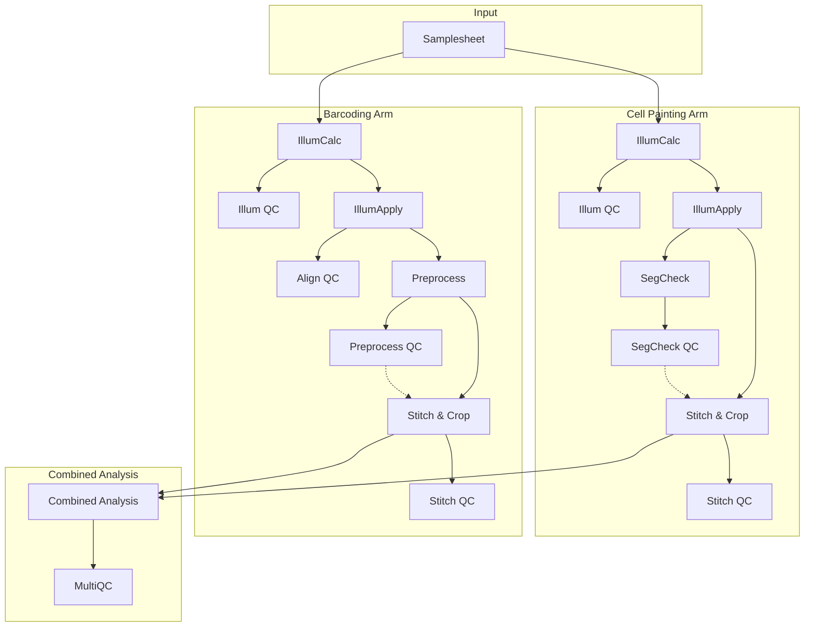

# nf-pooled-cellpainting

nf-pooled-cellpainting is a Nextflow pipeline for the processing and analysis of optical pooled screening (OPS) data combining Cell Painting phenotypic analysis with sequencing-by-synthesis barcoding.

## Introduction

The pipeline builds upon previous work by the Broad Institute and the [Cimini lab](https://cimini-lab.broadinstitute.org/) establishing large scale image analysis for cell painting assays.
nf-pooled-cellpainting processes optical pooled screening (OPS) data through two parallel processing arms:

- **Cell Painting Arm**: Phenotypic profiling using multi-channel fluorescence microscopy
- **Barcoding Arm**: Genetic barcoding using sequencing-by-synthesis (SBS)

The pipeline takes images of cells stained with cell painting markers and images of sequencing-by-synthesis (SBS) barcoding images as input and processes them through a number of image analysis and processing steps using Cellprofiler, Fiji and custom python scripts. A detailed workflow description can be found in the [Workflow](developer/architecture.md) section. A high level overview of the different steps in the pipeline is shown in the Mermaid diagram below.

## Key Features

- **Dual-arm, parallel processing** for painting and barcoding data
- **Illumination correction** via CellProfiler
- **Automated image stitching** with Fiji
- **Possibility for parallelization** at plate, well, and site levels
- **Quality control gates** at critical pipeline stages
- **Resumability** after manual QC and failed pipeline runs
- **CellProfiler plugin support** for barcode calling and color compensation
- **Easily portable across** cloud and HPC executions

### Repository overview

!!! quote "Repository Structure"
`     nf-pooled-cellpainting/
    ├── main.nf                    # Entry point
    ├── nextflow.config            # Main configuration
    ├── workflows/                 # Main workflow logic
    │   └── nf-pooled-cellpainting.nf
    ├── subworkflows/local/        # Pipeline subworkflows
    │   ├── cellpainting/          # Cell painting processing arm
    │   ├── barcoding/             # Barcoding processing arm
    │   └── utils*/                # Utility subworkflows
    ├── modules/local/             # Local process modules
    │   ├── cellprofiler/          # CellProfiler processes
    │   │   ├── illumcalc/         # Illumination calculation
    │   │   ├── illumapply/        # Illumination application
    │   │   ├── preprocess/        # Barcode preprocessing
    │   │   ├── segcheck/          # Segmentation QC
    │   │   └── combinedanalysis/  # Combined analysis
    │   ├── fiji/                  # Fiji image processing
    │   │   └── stitchcrop/        # Image stitching & cropping
    │   └── qc/                    # QC modules
    ├── bin/                       # Python scripts & tools
    ├── conf/                      # Configuration files
    ├── assets/                    # CellProfiler pipelines & resources
    ├── docs/                      # Documentation source
    └── tests/                     # nf-test test cases
    `

## Quick Links

- [Getting Started](getting-started/quickstart.md) - Install and run your first analysis
- [Parameters](usage/parameters.md) - Complete parameter reference
- [Architecture](developer/architecture.md) - Pipeline architecture and implementation
- [Seqera Platform](usage/seqera-platform.md) - Run on cloud and HPC infrastructure

## Citation

If you use this pipeline, please cite the original authors and tools:

**Pipeline Authors**: Florian Wuennemann, Erin Weisbart, Shantanu Singh, Ken Brewer

**Key Tools**:

- CellProfiler (Carpenter et al., 2006)
- Fiji/ImageJ (Schindelin et al., 2012)
- Nextflow (Di Tommaso et al., 2017)

See [CITATIONS.md](https://github.com/seqera-services/nf-pooled-cellpainting/blob/dev/CITATIONS.md) for a list of complete citations.

## Support

For questions and support:

- Open an issue on [GitHub](https://github.com/seqera-services/nf-pooled-cellpainting/issues)
- Review [Troubleshooting Guide](reference/troubleshooting.md)

## License

This pipeline is licensed under the [BSD 3-Clause License](LICENSE).

Portions of this software are derived from the nf-core project template and nf-core tools, which are licensed under the [MIT License](LICENSE-MIT). This includes the pipeline template structure, module patterns, configuration patterns, and utility functions.
