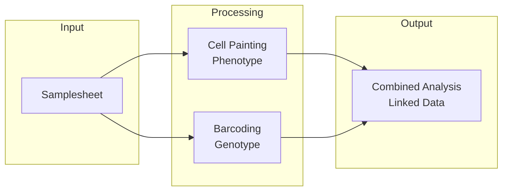

# nf-pooled-cellpainting

A Nextflow pipeline for processing and analyzing optical pooled screening (OPS) data, combining Cell Painting phenotypic analysis with sequencing-by-synthesis (SBS) barcoding.

## What This Pipeline Does

- **Processes** microscopy images through parallel Cell Painting and Barcoding arms
- **Corrects** illumination artifacts and aligns multi-cycle images
- **Segments** cells and extracts morphological features
- **Decodes** genetic barcodes and assigns them to individual cells
- **Produces** linked genotype-phenotype measurements at single-cell resolution

## Documentation

| Document | Description |
|----------|-------------|
| [User Guide](guide.md) | Installation, quickstart, custom data, AWS deployment, FAQ |
| [Parameters](parameters.md) | Complete parameter reference |
| [Technical Reference](reference.md) | Architecture, CellProfiler integration, outputs |

## Quick Links

**Getting Started**:

- [Installation](guide.md#installation)
- [Quick Start with Test Data](guide.md#quick-start)
- [Using Your Own Data](guide.md#using-your-own-data)

**Cloud Deployment**:

- [Running on AWS with Seqera Platform](guide.md#running-on-aws-with-seqera-platform)

**Reference**:

- [Pipeline Architecture](reference.md#architecture)
- [Output Formats](reference.md#output-reference)

## Key Features

- **Dual-arm parallel processing** for painting and barcoding data
- **Illumination correction** via CellProfiler
- **Automated image stitching** with Fiji
- **Quality control gates** at critical pipeline stages
- **Resumability** after manual QC review
- **Cloud-native** execution on AWS Batch via Seqera Platform

## Citation

If you use this pipeline, please cite the original authors and tools:

**Pipeline Authors**: Florian Wuennemann, Erin Weisbart, Shantanu Singh, Ken Brewer

**Key Tools**:

- CellProfiler (Carpenter et al., 2006)
- Fiji/ImageJ (Schindelin et al., 2012)
- Nextflow (Di Tommaso et al., 2017)

See [CITATIONS.md](https://github.com/broadinstitute/nf-pooled-cellpainting/blob/dev/CITATIONS.md) for complete citations.

## Support

- Open an issue on [GitHub](https://github.com/broadinstitute/nf-pooled-cellpainting/issues)
- Review the [FAQ](guide.md#frequently-asked-questions)
